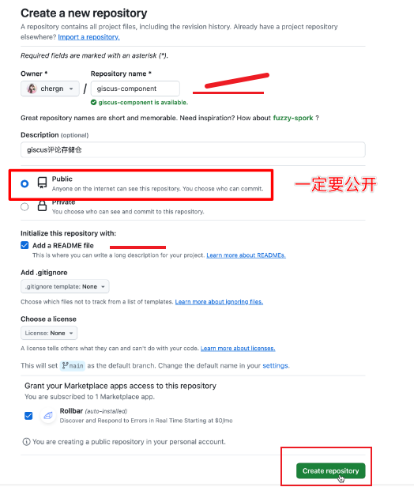
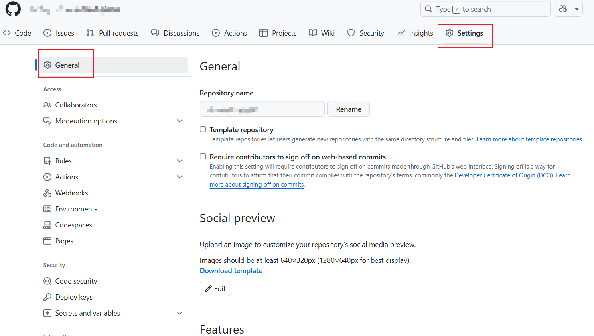
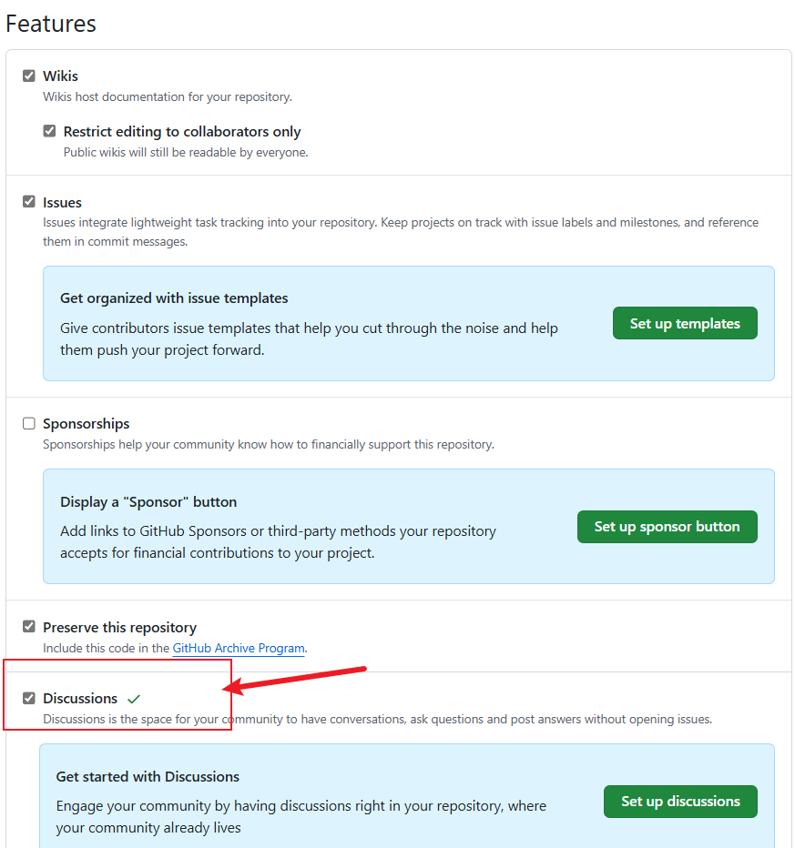
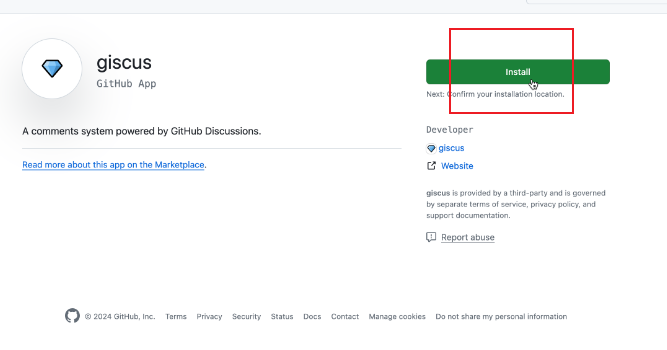
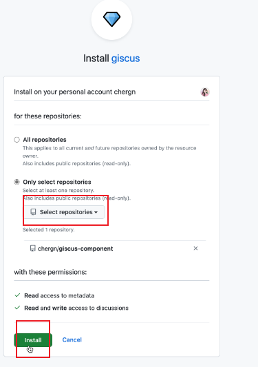
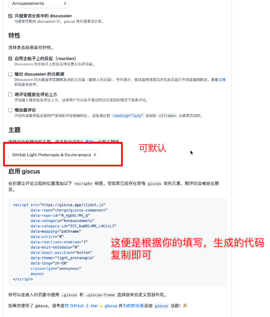
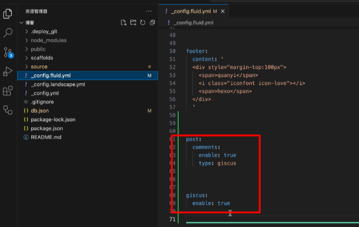
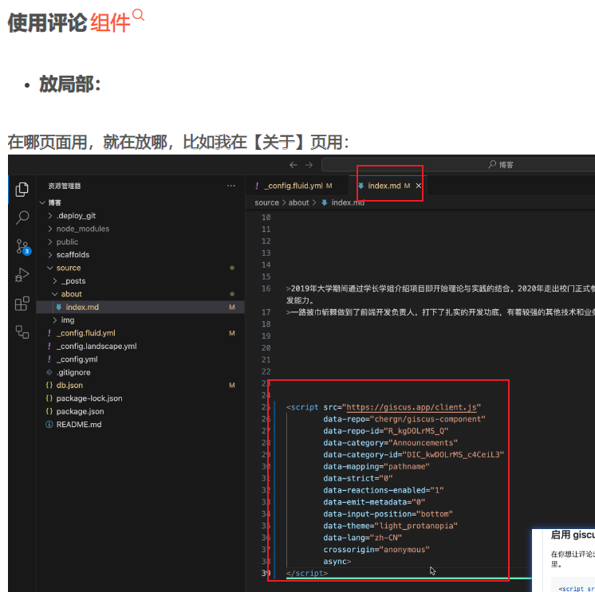
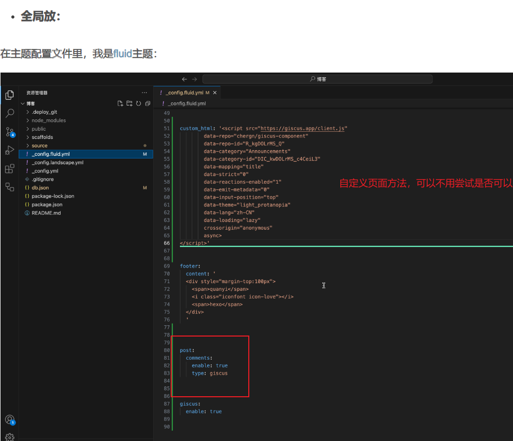
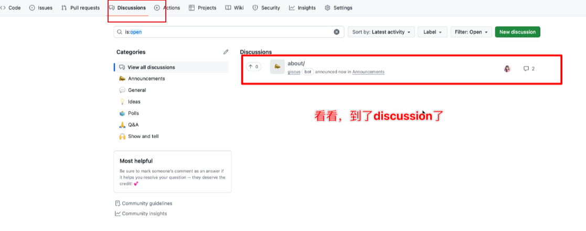

##  hexo 项目 fluid 主题下的 giscus 评论功能

##### 1.开启评论需要在主题配置中开启并指定评论模块

~~~tsx
基于 GitHub Discussion 实现
~~~

更多信息: [😙点击](https://hexo.fluid-dev.com/docs/guide/#%E8%AF%84%E8%AE%BA)


``` yaml
post:
  comments:
    enable: true
    type: disqus
    
# 自定义底部 HTML 内容（位于 footer 上方），也可用于外部引入 js css 这些操作，注意不要和 post.custom 配置冲突
custom_html: '获取的giscus 结果'

#补充主题中的配置信息(获取的giscus 结果)
giscus:
   repo:
   repo-id:
   category:
   category-id:
   theme-light: light
   theme-dark: dark
   mapping: pathname
   reactions-enabled: 1
   emit-metadata: 0
   input-position: top
   lang: zh-CN
    
另外的配置（测试不添加，可用）
disqus:
  shortname: fluid
```

##### 2.文章页关闭评论，或者想在某个自定义页面开启评论

~~~yaml
---
title: 关于页
layout: about
index_img: /img/example.jpg
date: 2019-10-10 10:00:00
comment: 'valine'
---
以下是正文内容：
comment: bool
例如：comment: 'type'、comment: 'valine'
~~~

##### 3.评论功能安装步骤

1先创建public项目，2开启discussions功能，3安装[插件](https://github.com/apps/giscus)

4生成[配置代码](https://giscus.app/zh-CN)

可参考的链接文档

[文档信息](https://giscus.app/zh-CN)、[Git Hub文档](https://docs.github.com/zh/repositories/managing-your-repositorys-settings-and-features/enabling-features-for-your-repository/enabling-or-disabling-github-discussions-for-a-repository)、[链接安装](https://github.com/apps/giscus)、
[生成 giscus 配置代码](https://giscus.app/zh-CN)、[参考1](https://github.com/giscus/giscus/blob/main/SELF-HOSTING.md)、[参考2-csdn](https://blog.csdn.net/qq_42618566/article/details/137494694)、[参考3-csdn](https://blog.csdn.net/Mo_0214/article/details/137501214)、[参考4](https://github.com/settings/apps/new)


#### 图片步骤

##### 1创建项目



##### 2开启discussions 模块功能





##### 3安装[插件](https://github.com/apps/giscus)后选择仓库





##### 4填写信息，生成[配置代码](https://giscus.app/zh-CN)




##### 5填写配置

1.

2.



3.


##### 6查看评论，对应仓库的discussions



参考别人的项目
## 参考

[^1]: [参考资料1](https://elarbor.github.io/about/)
[^2]: [参考资料2](https://blog.csdn.net/qq_42618566/article/details/137494694)
[^3]: [参考资料3](https://blog.csdn.net/Mo_0214/article/details/137501214)
[^4]: [参考资料4](https://cason.work/)
[^5]: [工具集合](https://tool.cason.work/)
