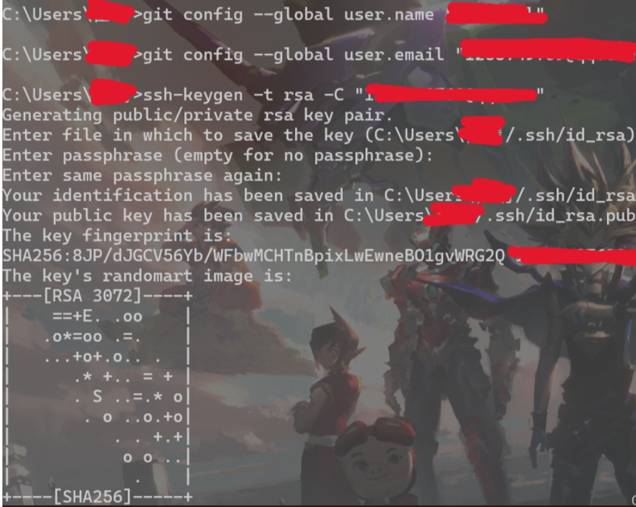
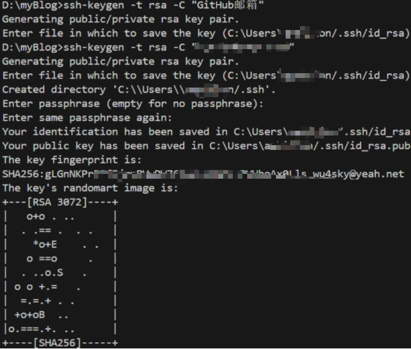
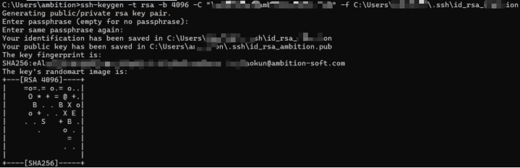
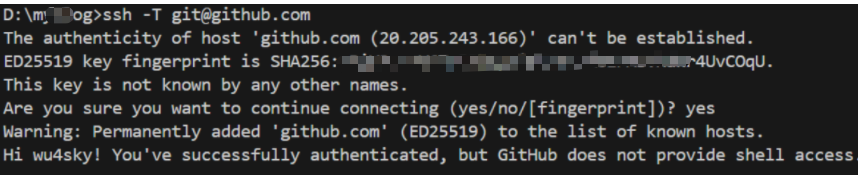

github-ssh

1.创建ssh密钥文件

或 ssh-keygen -t rsa -b 4096 -C "完整的邮箱地址" -f \~/.ssh/id_rsa_ambition

 	ssh-keygen -t rsa -b 4096 -C "完整的邮箱地址" -f C:\Users\ambition\.ssh\id_rsa_ambition

ssh-keygen -t rsa -C "GitHub邮箱" ,三此确认

2.获取公用密码上传github

径 C:\Users${name}/.ssh/id_rsa.pub，并用记事本打开，将内容复制

3.github 的SSH and GPG keys ，点击 New SSH key 创建新的秘钥

4.测试是否连接 

​	ssh -T git@github.com

ssh -T git@git.ambition-soft.com

ssh -i C:\Users\<YourUsername>\.ssh\id_rsa_ambition git@git.ambition-soft.com

多个秘钥

创建 config文件

Host git.xxx.cn

HostName git.xxx.cn

 User git

IdentityFile ~/.ssh/对应私有密钥

IdentitiesOnly yes

#配置 git.ambition-soft.com ssh -T git@git.ambition-soft.com

Host git.ambition-soft.com
  HostName git.ambition-soft.com
  User git
  IdentityFile ~/.ssh/id_rsa_ambition
  IdentitiesOnly yes

配置 git@github.com ssh -T git@github.com

Host github.com
  HostName github.com
  User git
  IdentityFile ~/.ssh/id_rsa
  IdentitiesOnly yes

