## 新技术

1.台账字段的显隐

~~~js
function $page_setInputDisplay(value) {
	let inputs = document.querySelectorAll('td[class*="PROJECT_NAME"] input');
    for(let input of inputs){
        if(input){
            input.style.display = value;
        }
    }
}
~~~

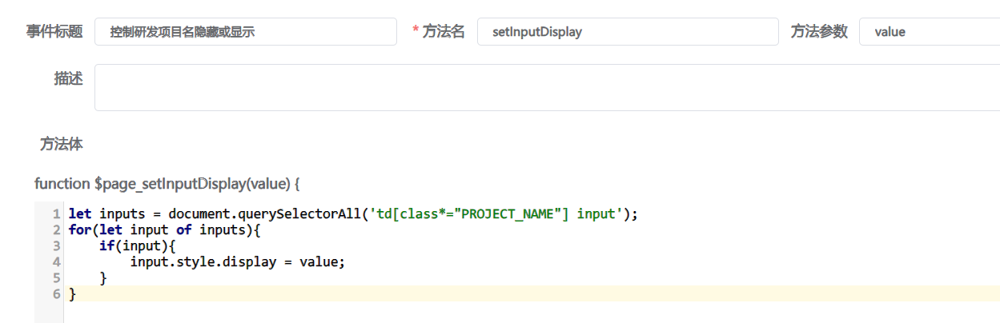

2.台账字段是否可编辑

~~~js
function changeSampleType(params) {
	//平台不推荐使用  能不用 则不用
    /**if('GENERAL_DEFECT_SAMPLE' === params.row['SAMPLE_TYPE']){
        params.row['PROJECT_NAME'] = '';
        $page_setInputDisplay('none');
    }else{
        $page_setInputDisplay('bolck');
    }*/
    //平台推荐使用  简单的逻辑操控 字段是否可编辑
    let entity = {}
    let isEndit = false;
    if('GENERAL_DEFECT_SAMPLE' !== params.row['SAMPLE_TYPE']){
        isEndit = true;
    }else{
        params.row['PROJECT_NAME'] = '';
    }
    entity = {'PROJECT_NAME':isEndit}
    this.fnProhibitToEdit(entity);
}
~~~

3.台账字段值，设置行颜色样式

~~~js
function rowStyle(params) {
	if('ID_SAMPLE' === params.row['SAMPLE_TYPE']){
        return {'backgroundColor':'red','color':'#FFFFFF'}
    }
}
~~~

4.台账字段，设置字段的背景颜色样式

~~~js
function cellStyle(params) {
	if('GENERAL_DEFECT_SAMPLE'===params.row['SAMPLE_TYPE']){
        return {'color':'red'}
    }
}
~~~

5.台账跳转子台账

需设置对应的字段的-“配置格式”。附加参数的方法：parentId=${obj.ID}&modelDataTableCode=JWQ_SAMPLE_SIGNING_DEPARTMENT

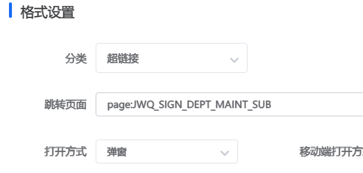

6.台账附件上传配置

新平台的附件需：两个字段，1附件名称，2附件ID

对于附件名称字段，配置-“控件-附件控件”，后配置对于的字段

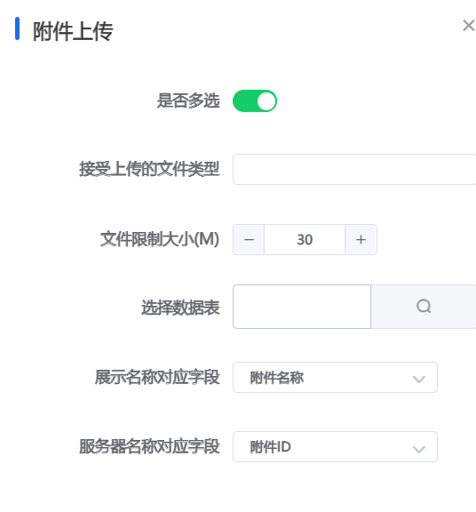

7.台账列表行样式

需在列表参数里配置

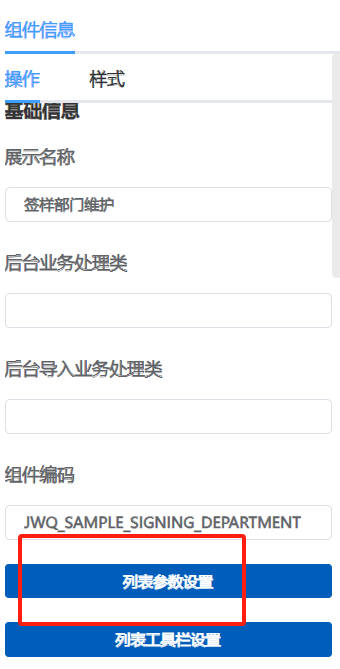

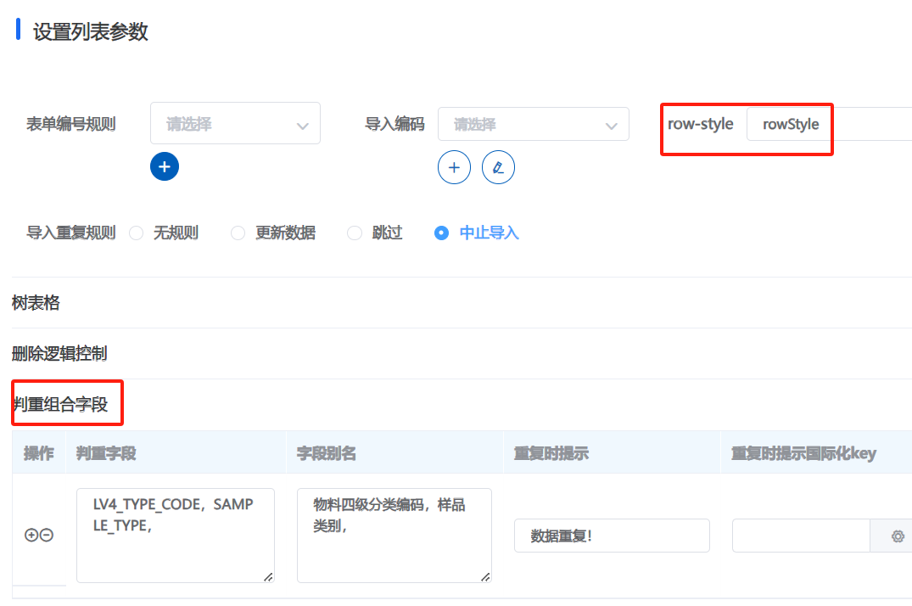

8.子台账过滤及获取父台账传递的值参数：默认值设置- ${request.fkId}，${request.fbId}

子表展示的的值（过滤条件）

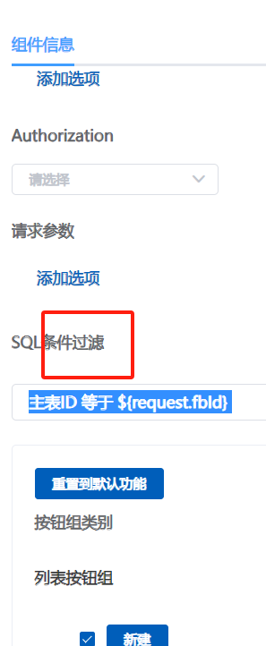

父表的格式配置

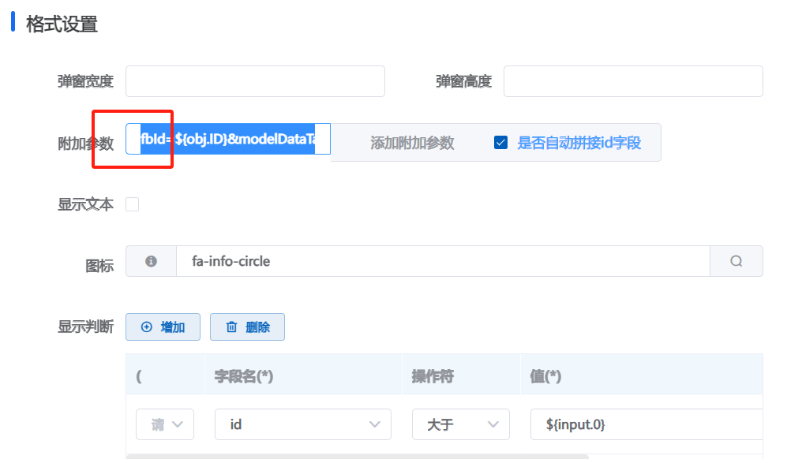

9.台账跳转表单

点击对应的按钮，配置跳转链接及条件

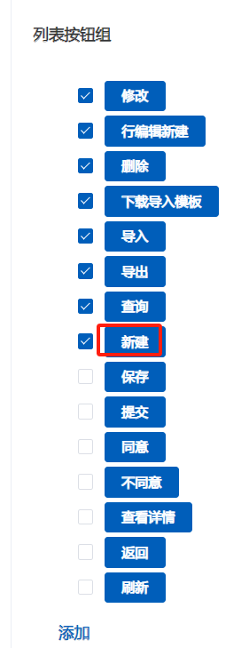

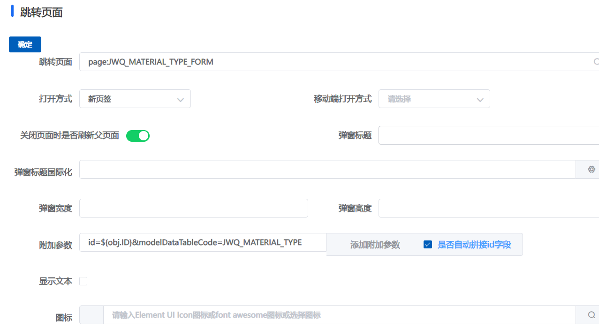

10.表单页面事件,事件写表单，绑定事件在对应子表（台账）字段绑定

​	表单设计，子表使用的是台账，事件绑定也在对应的字段，事件js内容在表单上

~~~js
//JWQ-检验项目子表-检验值改变事件
function changeInspectionValue(params) {
    console.log(params)
    const row = params.row
    const upperLimit = row.UPPER_LIMIT
    const lowerLimit = row.LOWER_LIMIT
    let isTrue = false
    if(!upperLimit){
        this.$message.warning("请先填写上限值")
        isTrue = true
    }else if(isNaN(upperLimit)){
        this.$message.warning("上限值必须为数字")
        isTrue = true
    }else if(!lowerLimit){
        this.$message.warning("请先填写下限值")
        isTrue = true
    }else if(isNaN(lowerLimit)){
        this.$message.warning("下限值必须为数字")
        isTrue = true
    }
    if(isTrue){
      row.INSPECTION_VALUE = ''
      return
    }
    const inspectionValue = row.INSPECTION_VALUE
    //判定是否在上下限范围内
    let fontColor = ''
    if(inspectionValue>= lowerLimit && inspectionValue <= upperLimit){
        params.row.INSPECTION_RESULT = '合格'
        fontColor = 'green'
    }else{
        params.row.INSPECTION_RESULT = '不合格'
        fontColor = 'red'
    }
    document.parent.querySelector("#INSPECTION_RESULT").style.color=fontColor

}

//JWQ-检验项目子表-检验结果样式
function inspectionResultStyle(params) {
    return {'color':'red'}
}

//JWQ-检验项目子表-检验结果改变事件
function inspectionResultChange(params) {
    params.parent["INSPECTION_RESULTS"] = 		params.parent['JWQ_INCOMING_INSPECTION_ITEM'].find(item => item['INSPECTION_RESULTS'] === '不合格')?'不合格':'合格'
this.refresMainTableFields(params.parent)

this.$set(params.parent,'INSPECTION_RESULTS',params.parent['JWQ_INCOMING_INSPECTION_ITEM'].find(item => item['INSPECTION_RESULTS'] === '不合格')?'不合格':'合格')

document.querySelertor('#INSPECTION_RESULTS').style.color = params.parent['INSPECTION_RESULTS'] === '不合格' ? 'red' : 'green' 
}
~~~

​	表单的子表的字段属性

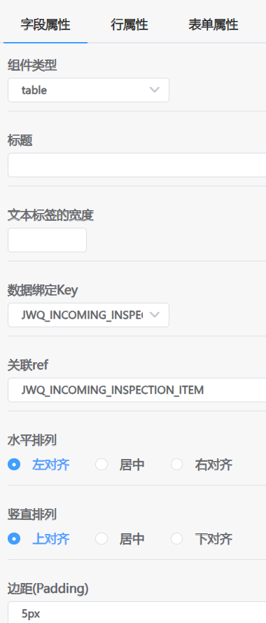

11.表单按钮事件

~~~js
function aaa(params){
 console.log("params==================>",params)
//客诉等级
const cusLevel = model.FORM_NO;
 console.log("cusLevel==================>",cusLevel)
}
~~~

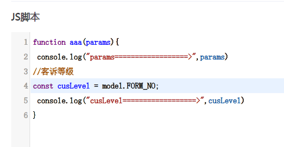

表单按钮保存前

~~~javascript
function LSC_REPORT__saveForm__beforeClick(params) {
    alert(1)
	return new Promise((resolver) => resolver()).then(() => console.log(1))
}
~~~

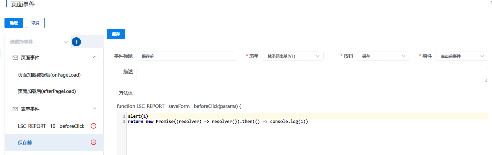

按钮自定义事件，自定义按钮后，页面事件绑定按钮

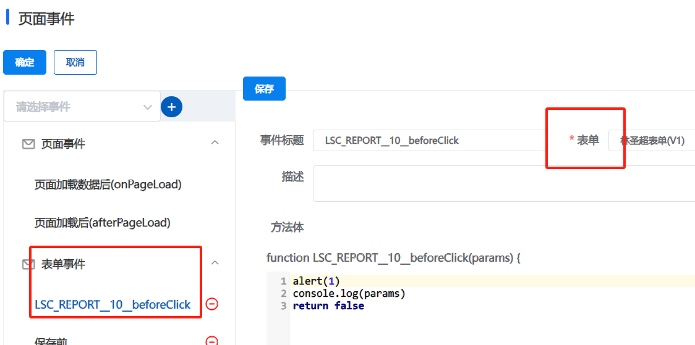

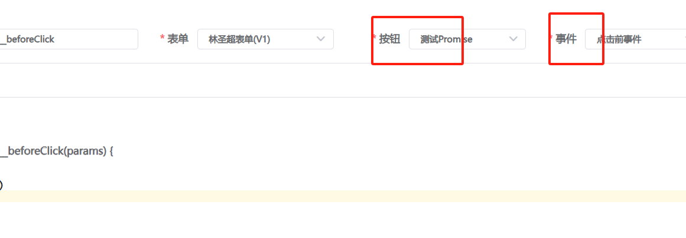

12.表单日期组件

需配置日期格式： yyyy-MM-dd HH:mm:ss

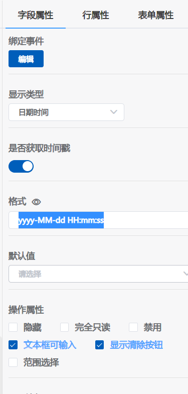

13.表单子表配置，获取子表数据来源前提条件值，

值可能表单，也可能在链接参数&gcmc=${obj.PROCESS_NAME}&

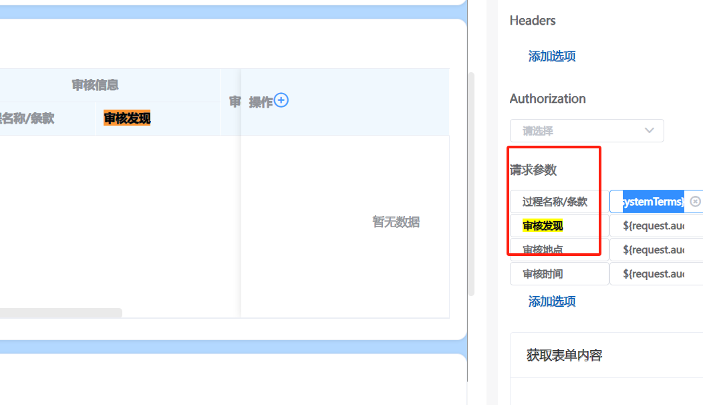

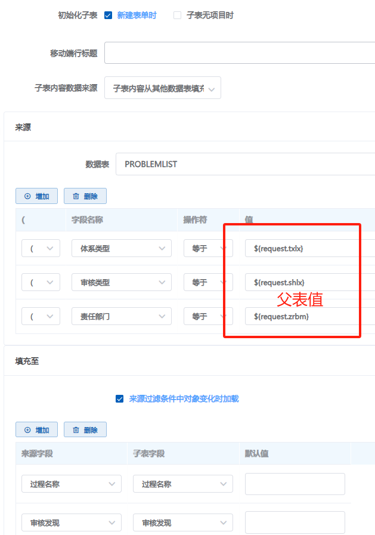

14.表单新建默认值配置

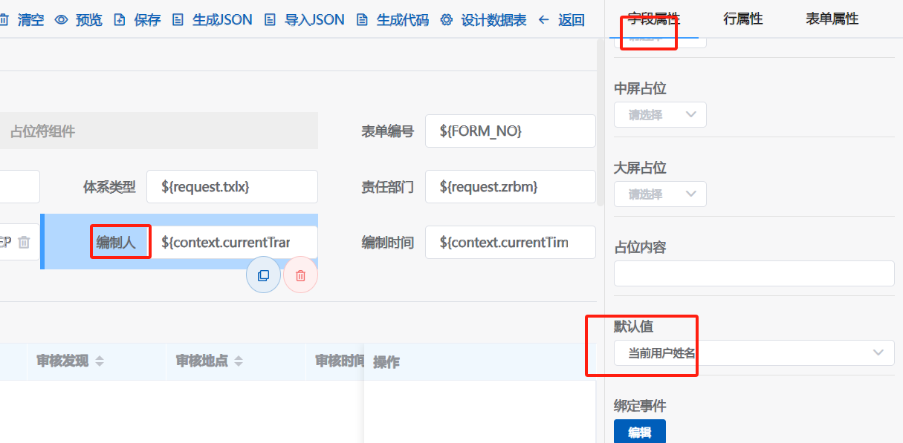

15.台账列表行编辑事件

~~~javascript
1 台账初始化
function IQC_SAMPLE_SIGNING_DEPARTMENT__afterListLoad(params) {
    params.gridData.forEach(function(item, index){
  if ('GENERAL_DEFECT_SAMPLE' === item) {
    const span = document.getElementById("PROJECT NAMEDomData" + index)
    span.closest('div').style.display = 'none'
  }
})
}

2 行编辑前
function IQC_SAMPLE_SIGNING_DEPARTMENT__beforeEdit(params) {
    let entity = {}
console.log(params)
if ('GENERAL_DEFECT_SAMPLE' === params.entity['SAMPLE_TYPE']) {
	entity = {'PROJECT_NAME':false}
} else {
   entity = {'PROJECT_NAME':true}
}
this.fnProhibitToEdit(entity)
}

3 其他自定义事件
//样品类别改变后
function changeSampleType(params) {
    debugger
if ('GENERAL_DEFECT_SAMPLE' === params.value) {
    params.row.PROJECT_NAME = '';
    // $page_setInputDisplay('none');
} else {
  //  $page_setInputDisplay('block');
}

let entity = {}
console.log(params)
if ('GENERAL_DEFECT_SAMPLE' === params.row['SAMPLE_TYPE']) {
	entity = {'PROJECT_NAME':false}
} else {
   entity = {'PROJECT_NAME':true}
}
this.fnProhibitToEdit(entity)
}
//自定义列样式
function cellStyle(params) {
    if ('GENERAL_DEFECT_SAMPLE' === params.row['SAMPLE_TYPE']) {
  return {'color':'red'}
}
}
//自定义行
function rowStyle(params) {
    if ('ID_SAMPLE' === params.row['SAMPLE_TYPE']) {
  return {'backgroundColor':'#e67423'}
}
}
//物料四级类别名称改变后
function changeLv4Type(params) {
    if ('GENERAL_DEFECT_SAMPLE' === params.row.SAMPLE_TYPE) {
    params.row.PROJECT_NAME = '';
    $page_setInputDisplay('none');
} else {
    $page_setInputDisplay('block');
}
}
//样式颜色
function headStyle(params) {
    return {'color' : 'green'}
}

4 控制研发项目名称隐藏或显示-自定义方法
function $page_setInputDisplay(value) {
    let inputs = document.querySelectorAll('td[class*="PROJECT_NAME"] input');
for (let input of inputs) {
  if (input) {
    input.style.display = value;
  }
}
}
~~~

16.
