## SQL server 数据库定时备份设置

#### 1.SQL Server代理已启用，此为前提

​	确保SQL Server代理已启动。如果显示“Agent XPs disabled”，请按 **Win+R**，输入 **services.msc** 并确定，在服务列表中启用SQL Server代理

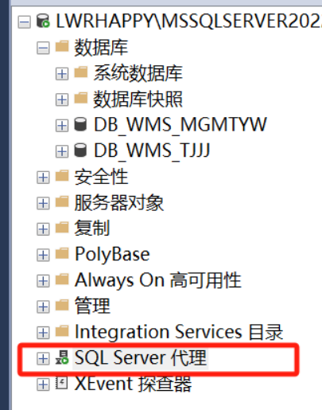

### 使用SQL Server Management Studio（SSMS）是微软SQL Server的集成管理工具操作

#### 2.新建维护计划

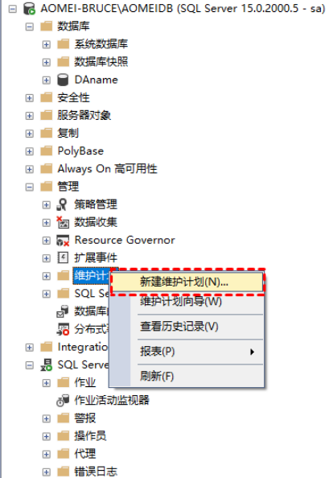

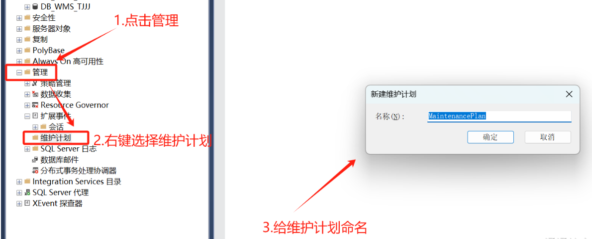

#### 3.设计维护计划-从工具箱获取维护计划

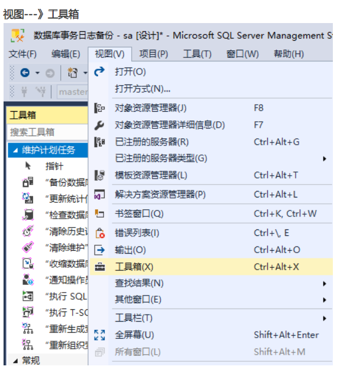

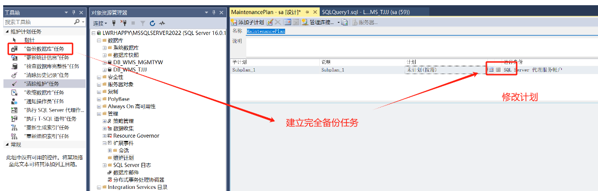

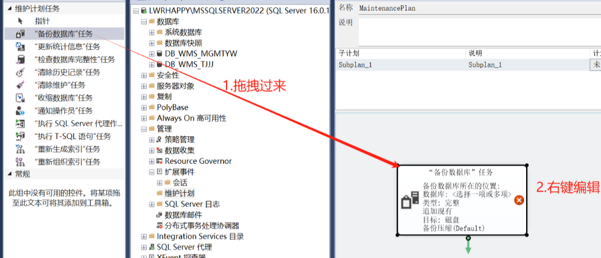

#### 4.设计计划内容

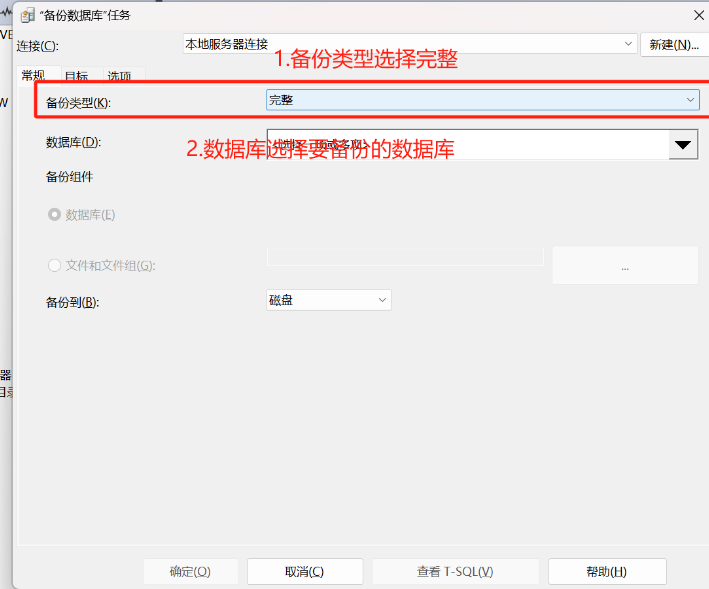

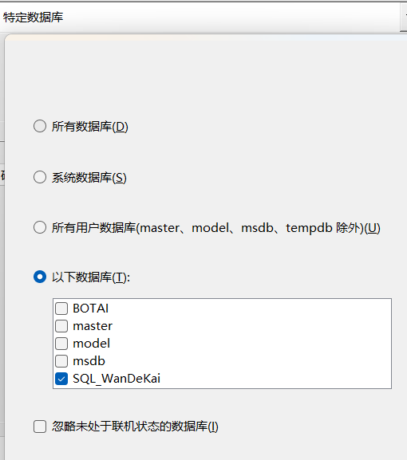

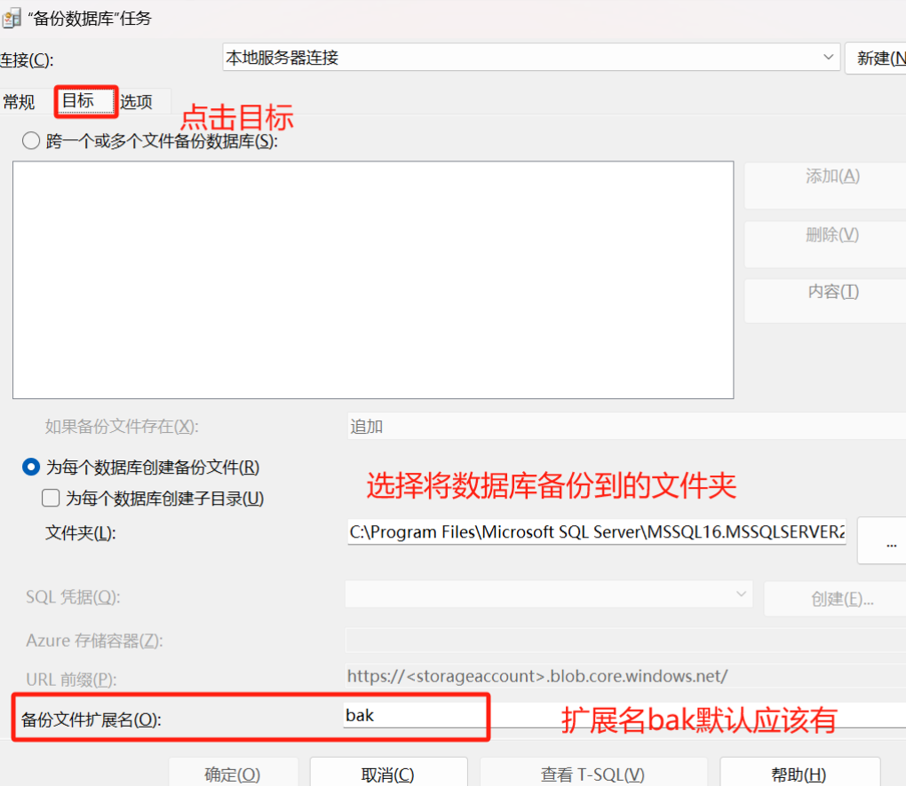

##### 可以使用其他的配置

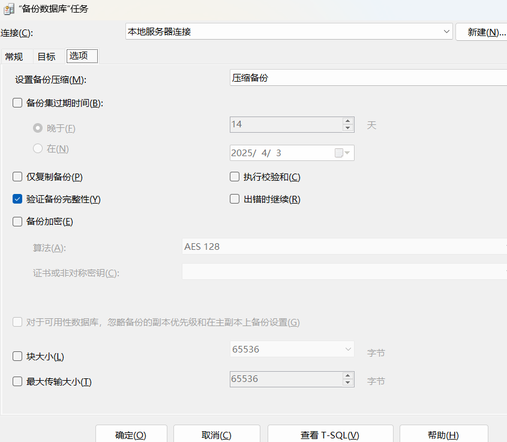

#### 5.设计计划运行时间，保存计划

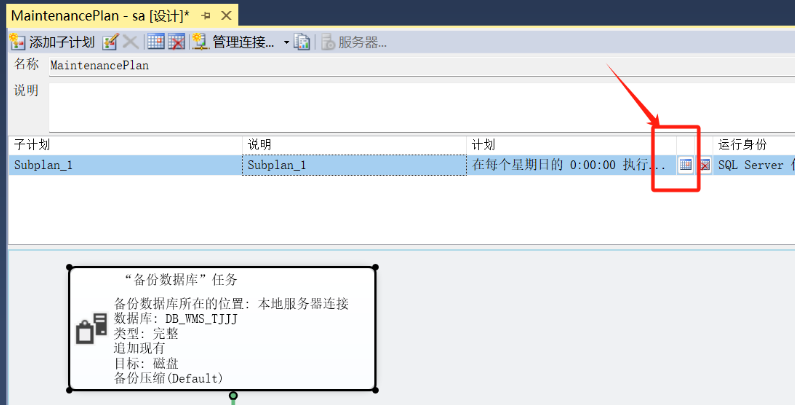

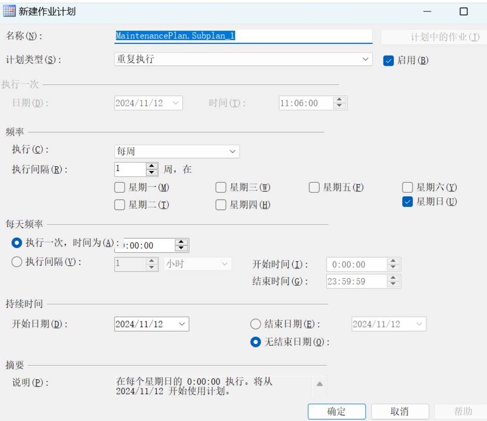

##### 可以在此，添加不同的子计划

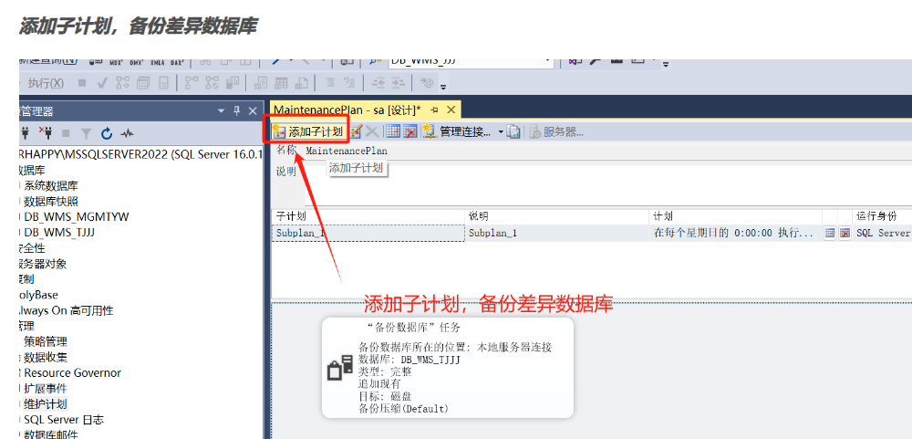

#### 6.设置清理任务

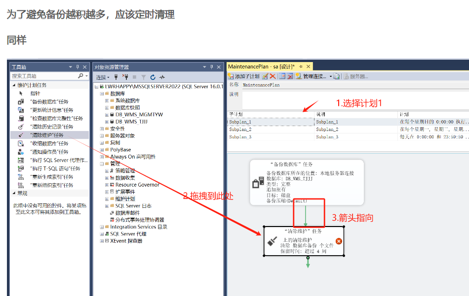

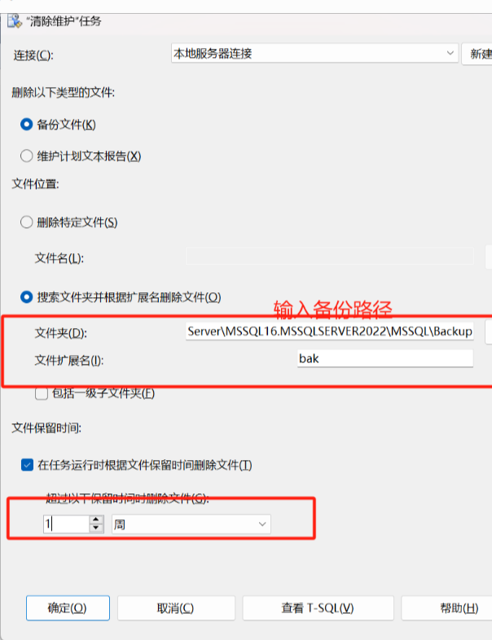

### 7.保存后进行计划测试

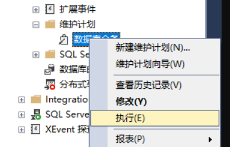

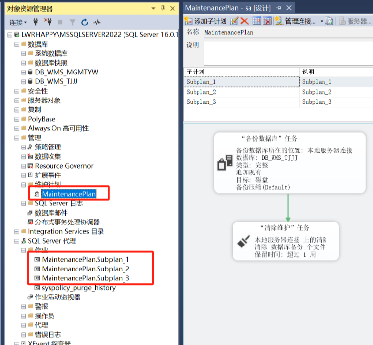

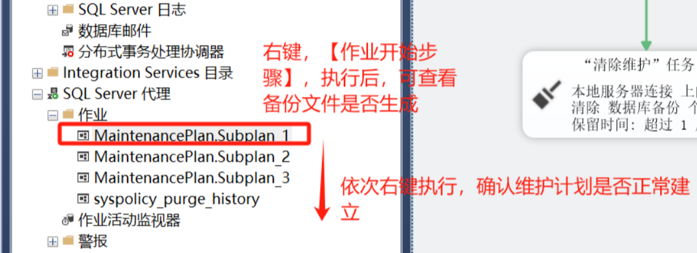

##### 或者 

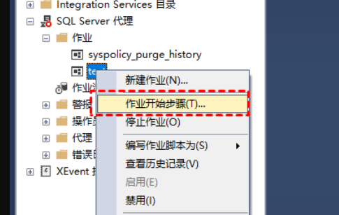

### 参考链接

[ 参考1](https://www.abackup.com/enterprise-backup/how-to-do-automatic-database-backup-666.html)

[参考2](https://blog.csdn.net/weixin_70604753/article/details/143708256)

[参考3](https://www.cnblogs.com/monkey6/p/17839068.html)

[备份恢复](https://blog.csdn.net/wuhao1468348557/article/details/108514985)
